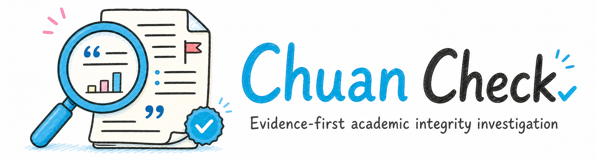

<p align="center">
  <a href="LICENSE"></a>
  
  
</p>

# Chuan Check

Chuan Check 是一个面向论文与学术出版物的证据优先审查 skill。它从论文原文、表格、图像、公式和参考文献出发，逐项记录可复核事实，并沿作者身份、机构经历、合作网络、引用关系、期刊出版流程和官方后续记录扩展筛查范围。

姓名、国籍、机构、跨国合作、产出模式和网络信息都可以作为中性线索，帮助发现同名消歧、潜在来源、共同编辑、异常引用或后续官方记录。它们的作用是扩大检索和建立关联，最终判断仍须回到具体文章、可靠身份锚点和可复核材料。

## 一分钟开始

先把仓库安装为 skill：

```text
请帮我安装这个 skill：
https://github.com/Rimagination/chuan-check
```

然后提供论文 PDF、DOI 或期刊页面，并说明希望的输出形式：

```text
请用 Chuan Check 审查这篇论文，重点检查数据、方法、图表和引用，输出带页码和证据等级的中文报告。
```

如果只想快速判断，可以说：

```text
请快速核查这篇论文有没有硬伤，并列出最需要作者解释的三项。
```

## 它能做什么

- 逐页核对研究对象、地点、时间、样本量、变量定义和结论是否一致
- 检查公式、统计量、标准误、p 值、样本数、图表和正文之间的内部一致性
- 追踪异常数字、图题、表题、坐标、连续短语和参考文献中的潜在来源
- 建立“目标论文—候选来源—官方数据—期刊记录”的证据账本
- 核对 DOI、作者单位、ORCID、引用关系和期刊后续通知
- 区分论文原文硬证据、网络线索、合理替代解释和待核查问题
- 输出快速核查、调查备忘录、编辑部材料、后续追踪或公开澄清草稿

## 核心原则

Chuan Check 默认遵循一条证据链：

```text
论文原文 → 结构化证据 → 必要的来源核对 → 作者/期刊官方记录 → 分级结论
```

审查时优先使用出版方正式 PDF、补充材料、勘误/撤稿通知、数据提供者页面和 DOI 记录。搜索摘要、社交媒体和 AI 报告只作为线索，不替代原文或官方证据。

每个重要发现尽量保留：

- 目标页码、图表号、公式号或段落
- 直接观察到的事实
- 复核方法和必要的计算
- 替代解释
- 证据等级与当前状态

## 证据等级

| 等级 | 含义 |
| --- | --- |
| A | 论文原文、原始 PDF、官方通知或可重复计算直接证明 |
| B | 多个独立材料一致支持，但仍存在合理替代解释 |
| C | 网络关系、模式异常或身份线索，适合继续调查 |
| D | 传闻、AI 推测或无法核实的身份判断，不进入最终定性 |

最终结论使用“未发现实质异常”“存在需要解释的问题”“达到正式编辑部调查门槛”或“官方已确认部分/全部问题”等审慎状态。

## 默认工作流

1. 固定论文版本、标题、作者、单位、期刊、DOI 和出版日期。
2. 获取全文并保留页码、版本和文件哈希。
3. 提取正文、图题、表题、公式、参考文献和数据声明。
4. 先做内部一致性检查，再寻找候选来源或外部记录。
5. 对数值、图表和文本建立逐项证据账本。
6. 单独核对作者、引用网络和期刊出版流程；不把它们替代论文级证据。
7. 给每项发现分级，明确事实、推断、线索和待核查项。

## 输出内容

一次完整调查通常包括：

- 前情与审查对象
- 硬证据发现
- 原文来源与逐项定位
- 数值、表格和公式复核
- 图像或文本来源核对
- 作者与引用网络线索
- 出版流程和官方后续记录
- 风险分级、局限和下一步核查请求

详细模板见：

- [`SKILL.md`](SKILL.md)：完整工作流和审查边界
- [`references/investigation-checklist.md`](references/investigation-checklist.md)：调查清单
- [`references/evidence-ledger.md`](references/evidence-ledger.md)：证据账本字段
- [`references/field-protocols.md`](references/field-protocols.md)：数值、图像、数据源和网络核查协议
- [`references/report-templates.md`](references/report-templates.md)：报告结构
- [`references/writing-guide.md`](references/writing-guide.md)：公开写作与措辞边界

## 线索扩展与证据收口

调查会主动利用以下信息扩大筛查：

- 姓名、姓名拼写变体、国籍、机构和邮箱域名，用于同名消歧与身份时间线核对；
- 合作者、共同编辑、特刊、引用群和单位变动，用于寻找直接或间接关联；
- 产出时间、主题跨度、图表模板和异常措辞，用于检索潜在来源与重复模式；
- 审稿周期、作者变更、关注声明、撤稿和期刊公告，用于核对出版流程与官方后续。

这些信息先进入线索表，再通过 DOI、ORCID、机构邮箱、单位时间线、稳定合作关系、具体页表对应或官方通知逐步确认。报告会清楚标记哪些是观察事实、调查推断、继续追查的线索，以及尚未解决的问题；证据不足时保留开放结论，而不是提前替材料作出定性。

## 许可

代码与 skill 文档采用 [MIT License](LICENSE)。论文 PDF、截图、图表和其他外部材料不随本仓库发布；使用时请遵守其来源和版权许可。
